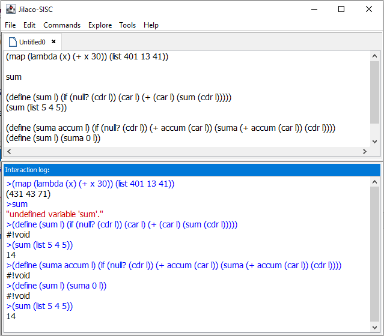

Many interpreted languages come with interactive evaluators which allow you to type expressions and see them interpreted. 
Such REPL (short for "read-eval-print-loop") tools are great for interactive development because they give you fast feedback.
However, on Windows such tools are often implemented as console applications with very rudimentary editing features, and
also relies on interpreter to load/save files, which doesn't always work. This tool comes to fix it.

Jilaco is a multi-tab editor which could be integrated with any scripting language implemented for JVM. 
Out-of box it provides integration with "Nashorn" JavaScript engine which comes with Java version 8, with SISC scheme interpreter, 
and with JShell. There is also a "Generic" implementation which will start child process (no matter, java-based or not) and
will communicate with it via standard input and output. As an example we provide integration with TinyScheme interpreter.

You can use editor tabs to open source files, or as scratch area for code you write. To ask interpter to execute current line, press Ctrl+Enter.
To ask interpreter to execute a selected text, press Ctrl+E.

